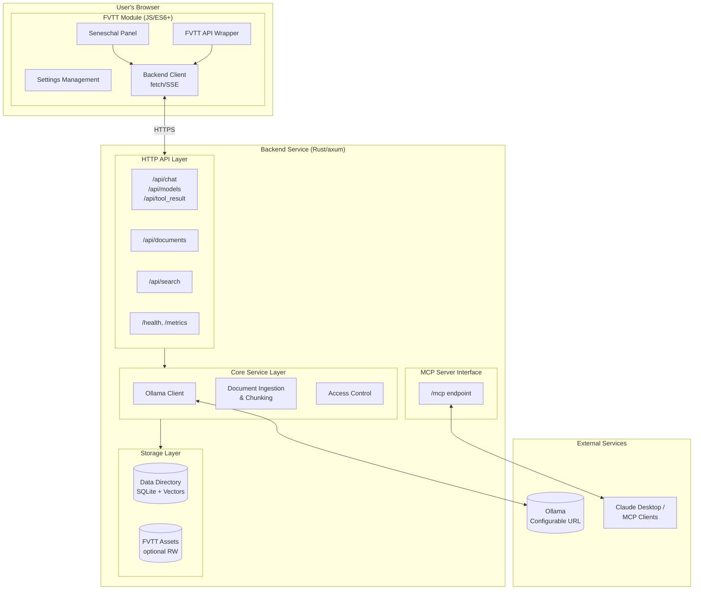
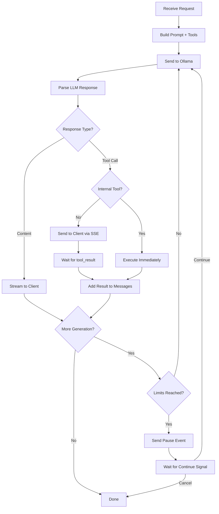
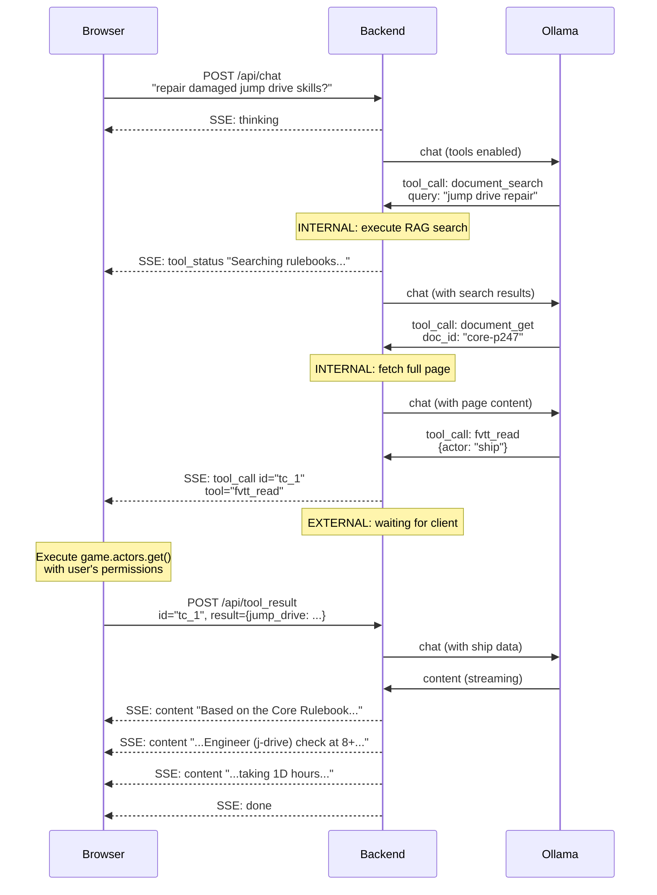

# Seneschal Program: Design & Requirements Document v0.4

**Repository:** https://github.com/jhelwig/seneschal-program

## Executive Summary

This document specifies the architecture for Seneschal, an AI-powered assistant for Foundry VTT game masters. The system consists of two components:

1. **FVTT Module** (`fvtt-seneschal`): Browser-based JavaScript module providing UI and FVTT API integration
2. **Backend Service** (`seneschal-service`): Rust-based service providing AI orchestration, RAG document retrieval, and MCP server interface

**Key Design Principles:**
- No localhost assumptions—all URLs configurable
- System-agnostic with native Mongoose Traveller 2e (`mgt2e`) support
- Player access with ACL-respecting execution
- Single self-contained backend (no additional services required)
- MCP server interface always available (usage optional)
- Internationalization (i18n) from the start

---

## 1. Architecture Overview



---

## 2. Critical Design Decisions

### 2.1 Conversation Interface: Dedicated Panel, Not Chat

**The FVTT chat log is NOT suitable for AI conversations.**

Research findings:
- `ChatMessage.update()` exists but triggers server broadcast + database write per call
- No documented support for rapid streaming updates
- Chat designed for discrete messages, not interactive conversations

**Solution:** The module provides a **dedicated Seneschal panel** (rendered via `Application` class) that:
- Maintains conversation state client-side
- Streams responses directly to DOM (no ChatMessage involvement)
- Supports multi-turn conversations with explicit session management
- Can optionally post final results/actions to the game chat as discrete messages

The `/ai` chat command remains available for **one-shot queries only**, with results posted as a complete ChatMessage after generation finishes.

### 2.2 Context Window Management

For multi-turn conversations, the module must manage context explicitly:

```typescript
interface ConversationSession {
  id: string;
  messages: ConversationMessage[];
  createdAt: Date;
  lastActivityAt: Date;
  
  // Context tracking
  totalTokensEstimate: number;
  maxContextTokens: number;  // From backend config
  
  // Attached context
  activeDocumentIds: string[];  // Documents being discussed
  activeActorIds: string[];     // Actors in focus
}

interface ConversationMessage {
  role: "user" | "assistant" | "system";
  content: string;
  timestamp: Date;
  tokenEstimate: number;
  
  // For assistant messages with tool use
  toolCalls?: ToolCall[];
  toolResults?: ToolResult[];
}
```

**Context window strategy:**
1. System prompt + game context always included
2. Recent messages included in reverse chronological order until budget exhausted
3. Older messages summarized or dropped with user notification
4. Documents retrieved via RAG added per-query (not persisted in conversation)

### 2.3 UserContext: Role-Based Access

```typescript
interface UserContext {
  userId: string;
  userName: string;
  role: number;  // CONST.USER_ROLES: 0=None, 1=Player, 2=Trusted, 3=Assistant, 4=GM
  ownedActorIds: string[];
  characterId?: string;
}
```

`isGM` is derived: `role >= 4` (GAMEMASTER role).

### 2.4 Communication Flow & Tool Execution

**Critical design decision:** Each user's browser initiates its own connection to the backend. The backend manages an **agentic loop** where the LLM can make multiple tool calls before producing a final response.

#### 2.4.1 Tool Classification

Tools are classified by where they execute:

| Tool | Location | Rationale |
|------|----------|-----------|
| `document_search` | Internal | RAG vector search on backend DB |
| `document_get` | Internal | Retrieve specific document chunks |
| `system_schema` | Internal | Game system schema (cached) |
| `traveller_uwp_parse` | Internal | Pure computation |
| `traveller_jump_calc` | Internal | Pure computation |
| `fvtt_read` | External | Requires FVTT API + user permissions |
| `fvtt_write` | External | Requires FVTT API + user permissions |
| `fvtt_query` | External | Requires FVTT API + user permissions |
| `dice_roll` | External | Should use FVTT dice system for logging |

**Internal tools:** Backend executes immediately, result fed back to LLM without client involvement.

**External tools:** Backend pauses, sends tool request to client via SSE, waits for client to execute and return result, then continues.

#### 2.4.2 Agentic Loop Architecture



#### 2.4.3 Detailed Sequence: Multi-Step Query

Example query: "What skill checks and durations are needed to repair a damaged jump drive?"



#### 2.4.4 SSE Event Types

```typescript
type SSEEvent = 
  | { type: "content"; text: string }                    // Streaming text from LLM
  | { type: "tool_call"; id: string; tool: string;       // External tool request
      args: Record<string, unknown> }
  | { type: "tool_status"; message: string }             // Internal tool progress
  | { type: "tool_result"; id: string;                   // Internal tool completed (optional transparency)
      tool: string; summary: string }
  | { type: "pause"; reason: "tool_limit" | "time_limit";  // Loop limit reached
      tool_calls_made: number; elapsed_seconds: number;
      message: string }                                  // Human-readable explanation
  | { type: "error"; message: string; recoverable: boolean }
  | { type: "done"; usage?: { prompt_tokens: number; completion_tokens: number } }
```

**Client responses to pause:**
```typescript
// To continue after a pause:
POST /api/chat/continue
{ "conversation_id": "conv_xyz", "action": "continue" }

// To cancel:
POST /api/chat/continue  
{ "conversation_id": "conv_xyz", "action": "cancel" }
```

#### 2.4.5 Loop Limits & Pause Behavior

```rust
pub struct AgenticLoopConfig {
    /// Tool calls before pause prompt (internal + external combined)
    pub tool_call_pause_threshold: u32,  // Default: 10
    
    /// Maximum internal tool calls before requiring at least one LLM response
    pub max_consecutive_internal: u32,  // Default: 5
    
    /// Time before pause prompt (entire request including all loops)
    pub time_pause_threshold: Duration,  // Default: 60s
    
    /// Hard timeout (cannot continue past this)
    pub hard_timeout: Duration,  // Default: 300s
    
    /// Timeout waiting for external tool result from client
    pub external_tool_timeout: Duration,  // Default: 30s
}
```

**When thresholds are reached:**

1. Backend sends `SSE: pause` with reason and current progress
2. Client displays: "Seneschal has made 10 tool calls. Continue?"
3. User can choose to continue or cancel
4. If continue: loop resumes, thresholds reset for another cycle
5. If cancel: backend sends partial results gathered so far

**Hard limits (cannot continue past):**
- `hard_timeout`: Absolute maximum time (default 5 minutes)
- `max_consecutive_internal`: Prevents infinite internal loops without LLM output

```rust
// Example pause event
SSEEvent::Pause {
    reason: PauseReason::ToolLimit,
    tool_calls_made: 10,
    elapsed_seconds: 45,
    message: "Seneschal has made 10 tool calls searching for information. Would you like to continue?",
}
```

#### 2.4.6 Conversation State Management

**Storage architecture:**

```rust
/// In-memory state for active requests (short-lived)
struct ActiveRequests {
    /// Keyed by conversation_id
    requests: DashMap<String, ActiveRequest>,
}

/// Persisted conversation state (SQLite)
struct ConversationStore {
    db: rusqlite::Connection,
}
```

**Active request state (in-memory only):**

```rust
struct ActiveRequest {
    conversation_id: String,
    user_context: UserContext,
    
    // Message accumulator (grows during agentic loop)
    messages: Vec<Message>,
    
    // Tool tracking
    tool_calls_made: u32,
    pending_external_tool: Option<PendingToolCall>,
    
    // Pause state
    paused: bool,
    
    // Timing
    started_at: Instant,
}

struct PendingToolCall {
    id: String,
    tool: String,
    args: serde_json::Value,
    sent_at: Instant,
}
```

Active requests exist only while a request is being processed. They are removed when:
- Request completes (done event sent)
- Request is cancelled
- `hard_timeout` exceeded
- Client disconnects (SSE connection closed)

**Persisted conversation state (SQLite):**

```sql
CREATE TABLE conversations (
    id TEXT PRIMARY KEY,
    user_id TEXT NOT NULL,
    created_at TEXT NOT NULL,
    updated_at TEXT NOT NULL,
    messages TEXT NOT NULL,  -- JSON array of messages
    metadata TEXT            -- JSON: activeDocumentIds, activeActorIds, etc.
);

CREATE INDEX idx_conversations_user ON conversations(user_id);
CREATE INDEX idx_conversations_updated ON conversations(updated_at);
```

```rust
struct PersistedConversation {
    id: String,
    user_id: String,
    created_at: DateTime<Utc>,
    updated_at: DateTime<Utc>,
    messages: Vec<Message>,
    metadata: ConversationMetadata,
}

struct ConversationMetadata {
    active_document_ids: Vec<String>,
    active_actor_ids: Vec<String>,
    total_tokens_estimate: u32,
}
```

**Conversation lifecycle:**

| Event | Action |
|-------|--------|
| First message in new conversation | Create DB row |
| Request completes successfully | Update DB with new messages |
| Request cancelled mid-loop | Update DB with messages so far |
| User starts new conversation | New conversation_id, new DB row |
| Conversation idle > `conversation_ttl` | Eligible for cleanup |

**Cleanup policy:**

```rust
pub struct ConversationConfig {
    /// How long to keep conversations before cleanup
    pub conversation_ttl: Duration,  // Default: 7 days
    
    /// Run cleanup every N hours  
    pub cleanup_interval: Duration,  // Default: 24 hours
    
    /// Maximum conversations per user (0 = unlimited)
    pub max_per_user: u32,  // Default: 100
}
```

Cleanup runs periodically:
1. Delete conversations older than `conversation_ttl`
2. If user exceeds `max_per_user`, delete oldest first

**When external tool result arrives (`POST /api/tool_result`):**

1. Look up `conversation_id` in `ActiveRequests`
2. If not found: return 404 (request timed out or completed)
3. Match `tool_call_id` to `pending_external_tool`
4. If mismatch: return 400 (wrong tool call)
5. Add tool result to `messages`
6. Clear `pending_external_tool`
7. Resume Ollama generation

**GM vs Player queries:**
- GM queries come from GM's browser (role=4, sees all documents)
- Player queries come from player's browser (role=1, sees only `access_level.accessible_by(role)` documents)
- Each user's session is independent
- Internal tools (RAG search) filter results by user's role automatically

---

## 3. FVTT Module Specification

### 3.1 Module Manifest (`module.json`)

```json
{
  "id": "fvtt-seneschal",
  "title": "Seneschal",
  "description": "AI-powered assistant for game masters supporting rule lookups, entity creation, and campaign management",
  "version": "0.1.0",
  "compatibility": {
    "minimum": "12",
    "verified": "13"
  },
  "authors": [
    {
      "name": "Jacob Helwig",
      "url": "https://github.com/jhelwig"
    }
  ],
  "url": "https://github.com/jhelwig/seneschal-program",
  "bugs": "https://github.com/jhelwig/seneschal-program/issues",
  "esmodules": ["scripts/main.mjs"],
  "styles": ["styles/seneschal.css"],
  "socket": true,
  "languages": [
    {
      "lang": "en",
      "name": "English",
      "path": "lang/en.json"
    }
  ]
}
```

### 3.2 Settings Schema

| Setting Key | Type | Scope | Default | Description |
|-------------|------|-------|---------|-------------|
| `backendUrl` | String | world | `""` | Backend service URL (required) |
| `apiKey` | String | client | `""` | Per-user API key for backend auth |
| `chatModel` | String | world | `""` | Ollama model for chat (dropdown from `/api/models`) |
| `visionModel` | String | world | `""` | Ollama model for image captioning (dropdown from `/api/models`) |
| `enablePlayerAccess` | Boolean | world | `false` | Allow players to use Seneschal |
| `maxActionsPerRequest` | Number | world | `5` | Limit AI actions per request |
| `chatCommandPrefix` | String | world | `/sen-ai` | Chat command prefix (one-shot queries) |

**Model Selection:** Both `chatModel` and `visionModel` are populated via dropdown from the `/api/models` endpoint. Vision models (e.g., `llava`, `llava-llama3`, `moondream`) are used during document ingestion to caption extracted images for searchability.

### 3.3 Seneschal Panel

The primary interface is an `Application` subclass:

```javascript
class SeneschalPanel extends Application {
  static get defaultOptions() {
    return foundry.utils.mergeObject(super.defaultOptions, {
      id: "seneschal-panel",
      title: game.i18n.localize("SENESCHAL.PanelTitle"),
      template: "modules/fvtt-seneschal/templates/panel.hbs",
      width: 400,
      height: 600,
      resizable: true,
      minimizable: true
    });
  }
  
  constructor(options = {}) {
    super(options);
    this.session = new ConversationSession();
    this.backendClient = new BackendClient();
  }
  
  async _handleUserMessage(content) {
    // Add user message to session
    this.session.addMessage({ role: "user", content });
    this._renderMessage({ role: "user", content });
    
    // Create placeholder for Seneschal response
    const responseEl = this._createResponsePlaceholder();
    
    // Stream response
    await this.backendClient.streamChat({
      messages: this.session.getMessagesForContext(),
      userContext: buildUserContext(),
      onChunk: (text) => this._appendToResponse(responseEl, text),
      onComplete: (fullResponse, toolCalls) => {
        this.session.addMessage({ 
          role: "assistant", 
          content: fullResponse,
          toolCalls 
        });
        this._finalizeResponse(responseEl);
      },
      onError: (error) => this._showError(responseEl, error)
    });
  }
}
```

### 3.4 One-Shot Chat Command

For quick queries that don't need conversation context:

```javascript
Hooks.on("chatMessage", (chatLog, message, chatData) => {
  const prefix = game.settings.get("fvtt-seneschal", "chatCommandPrefix");
  if (!message.startsWith(prefix + " ")) return true;
  
  const query = message.slice(prefix.length + 1);
  handleOneShotQuery(query, chatData);
  return false;
});

async function handleOneShotQuery(query, chatData) {
  // Show "thinking" indicator
  const thinkingMsg = await ChatMessage.create({
    content: `<div class="seneschal-thinking">${game.i18n.localize("SENESCHAL.Thinking")}</div>`,
    speaker: { alias: game.i18n.localize("SENESCHAL.Name") },
    whisper: game.user.role < 4 ? [game.user.id] : []
  });
  
  try {
    // Get complete response (no streaming to chat)
    const response = await backendClient.chat({
      messages: [{ role: "user", content: query }],
      userContext: buildUserContext(),
      stream: false
    });
    
    // Replace thinking message with result
    await thinkingMsg.update({
      content: `<div class="ai-response">${marked.parse(response.content)}</div>`
    });
  } catch (error) {
    await thinkingMsg.update({
      content: `<div class="seneschal-error">${game.i18n.localize("SENESCHAL.Error")}: ${error.message}</div>`
    });
  }
}
```

### 3.5 FVTT API Wrapper

#### 3.5.1 Permission Checking

```javascript
function canUserAccess(document, userContext, requiredLevel) {
  const user = game.users.get(userContext.userId);
  if (!user) return false;
  
  // GM can access everything
  if (userContext.role >= 4) return true;
  
  return document.testUserPermission(user, requiredLevel);
}

function canUserModify(document, userContext) {
  return canUserAccess(document, userContext, "OWNER");
}
```

#### 3.5.2 Game System Schema Discovery

```javascript
function getSystemCapabilities() {
  return {
    system: game.system.id,
    systemTitle: game.system.title,
    actorTypes: game.documentTypes.Actor,
    itemTypes: game.documentTypes.Item,
    actorSchemas: Object.fromEntries(
      game.documentTypes.Actor.map(type => [
        type,
        describeSchema(CONFIG.Actor.dataModels?.[type]?.schema)
      ])
    ),
    itemSchemas: Object.fromEntries(
      game.documentTypes.Item.map(type => [
        type,
        describeSchema(CONFIG.Item.dataModels?.[type]?.schema)
      ])
    )
  };
}
```

### 3.6 Mongoose Traveller 2e Native Support

For the `mgt2e` system, provide enhanced schema awareness:

```javascript
const MGT2E_ENHANCEMENTS = {
  actorTypes: {
    traveller: {
      description: "Player character or NPC with full characteristics",
      characteristics: ["strength", "dexterity", "endurance", "intellect", "education", "social"],
      skillSystem: "Skills are embedded Items with value and optional speciality"
    },
    npc: {
      description: "Simplified NPC without full career history"
    },
    creature: {
      description: "Animal or alien creature with instinct-based behavior"
    },
    spacecraft: {
      description: "Starship with tonnage, jump rating, and crew positions"
    },
    vehicle: {
      description: "Ground or air vehicle"
    },
    world: {
      description: "Planet with UWP (Universal World Profile) data"
    }
  },
  itemTypes: {
    weapon: { key_fields: ["damage", "range", "traits", "tl"] },
    armour: { key_fields: ["protection", "tl", "radiation"] },
    skill: { key_fields: ["value", "speciality"] },
    term: { key_fields: ["career", "assignment", "rank"] }
  },
  uwpFormat: "Starport-Size-Atmo-Hydro-Pop-Gov-Law-TL (e.g., A867949-C)"
};

function getMgt2eEnhancements() {
  if (game.system.id !== "mgt2e") return null;
  return MGT2E_ENHANCEMENTS;
}
```

---

## 4. Backend Service Specification

### 4.1 Technology Stack

| Component | Crate | Rationale |
|-----------|-------|-----------|
| HTTP Framework | `axum` 0.7+ | Async, tower ecosystem |
| Configuration | `config` | Multi-source config with layering |
| Error Handling | `thiserror` + `rootcause` | Typed errors with context chains |
| Database | `rusqlite` + `sqlite-vec` | Single-file with vector search |
| Embeddings | `fastembed` | ONNX-based, no PyTorch |
| PDF Extraction | `pdfium-render` | Text + image extraction, Apache 2.0 licensed |
| Image Processing | `image` | WebP encoding for FVTT optimization |
| EPUB Parsing | `epub` | Standard EPUB2/3 |
| MCP Server | `rmcp` 0.8+ | Official SDK, SSE transport |
| Async Runtime | `tokio` | Standard |
| Metrics | `metrics` + `metrics-exporter-prometheus` | OTel-compatible |
| Logging | `tracing` + `tracing-subscriber` | Structured JSON output |
| i18n | `fluent` | Mozilla's i18n system |

### 4.2 Configuration

Using the `config` crate with layered sources: defaults → config file → environment variables.

```rust
use config::{Config, Environment, File};
use serde::Deserialize;
use std::path::PathBuf;

#[derive(Debug, Deserialize)]
pub struct AppConfig {
    #[serde(default = "default_server")]
    pub server: ServerConfig,
    
    #[serde(default = "default_ollama")]
    pub ollama: OllamaConfig,
    
    #[serde(default = "default_embeddings")]
    pub embeddings: EmbeddingsConfig,
    
    #[serde(default = "default_storage")]
    pub storage: StorageConfig,
    
    #[serde(default)]
    pub fvtt: FvttConfig,
    
    #[serde(default = "default_mcp")]
    pub mcp: McpConfig,
    
    #[serde(default = "default_limits")]
    pub limits: LimitsConfig,
}

#[derive(Debug, Deserialize)]
pub struct ServerConfig {
    #[serde(default = "default_host")]
    pub host: String,  // "0.0.0.0"
    
    #[serde(default = "default_port")]
    pub port: u16,  // 8080
}

#[derive(Debug, Deserialize)]
pub struct OllamaConfig {
    #[serde(default = "default_ollama_url")]
    pub base_url: String,  // "http://localhost:11434"
    
    #[serde(default = "default_model")]
    pub default_model: String,  // "llama3.2"
    
    #[serde(default = "default_temperature")]
    pub temperature: f32,  // 0.7
}

#[derive(Debug, Deserialize)]
pub struct StorageConfig {
    #[serde(default = "default_data_dir")]
    pub data_dir: PathBuf,  // "./data"
    // Creates: data/seneschal.db, data/documents/, data/images/
}

#[derive(Debug, Deserialize)]
pub struct LimitsConfig {
    #[serde(default = "default_max_document_size")]
    pub max_document_size_bytes: u64,  // 104_857_600 (100MB)
    
    #[serde(default = "default_rate_limit")]
    pub rate_limit_rpm: u32,  // 60
}

#[derive(Debug, Deserialize)]
pub struct McpConfig {
    #[serde(default = "default_mcp_path")]
    pub path: String,  // "/mcp"
}

#[derive(Debug, Deserialize, Default)]
pub struct FvttConfig {
    /// Path to FVTT assets directory (Data/assets). If provided and writable,
    /// images are copied directly. Otherwise, shuttled via API.
    #[serde(default)]
    pub assets_path: Option<PathBuf>,
}

impl AppConfig {
    pub fn load() -> Result<Self, config::ConfigError> {
        Config::builder()
            // Start with defaults (compiled in)
            .set_default("server.host", "0.0.0.0")?
            .set_default("server.port", 8080)?
            .set_default("ollama.base_url", "http://localhost:11434")?
            .set_default("ollama.default_model", "llama3.2")?
            .set_default("ollama.temperature", 0.7)?
            .set_default("storage.data_dir", "./data")?
            .set_default("limits.max_document_size_bytes", 104_857_600_u64)?
            .set_default("mcp.path", "/mcp")?
            // Layer config file if present
            .add_source(File::with_name("config").required(false))
            // Layer environment variables (prefix: SENESCHAL_)
            .add_source(
                Environment::with_prefix("SENESCHAL")
                    .separator("__")
                    .try_parsing(true)
            )
            .build()?
            .try_deserialize()
    }
}
```

**Example config.toml:**

```toml
[server]
host = "0.0.0.0"
port = 8080

[ollama]
base_url = "http://localhost:11434"
default_model = "llama3.2"

[storage]
data_dir = "/var/lib/seneschal"

[fvtt]
assets_path = "/var/lib/foundryvtt/Data/assets"

[limits]
max_document_size_bytes = 104857600  # 100MB
```

**Environment variable mapping:**
- `SENESCHAL__SERVER__PORT=8080`
- `SENESCHAL__OLLAMA__BASE_URL=http://ollama.local:11434`
- `SENESCHAL__STORAGE__DATA_DIR=/data`

### 4.3 API Endpoints

#### 4.3.1 Health & Metrics

```
GET /health
→ { "status": "healthy", "version": "0.1.0" }

GET /metrics
→ Prometheus format metrics
```

#### 4.3.2 Model Discovery

The backend queries Ollama's `/api/tags` and `/api/show` endpoints to discover available models and their context limits.

```rust
/// Model information discovered from Ollama
#[derive(Debug, Clone, Serialize, Deserialize)]
pub struct ModelInfo {
    pub name: String,
    pub context_length: Option<u64>,
    pub parameter_size: Option<String>,
    pub quantization: Option<String>,
}

impl OllamaClient {
    /// List available models with their capabilities
    pub async fn list_models(&self) -> Result<Vec<ModelInfo>> {
        // GET /api/tags returns list of models
        let tags: TagsResponse = self.get("/api/tags").await?;
        
        let mut models = Vec::new();
        for model in tags.models {
            // POST /api/show returns detailed model info
            let show: ShowResponse = self.post("/api/show", json!({ "name": &model.name })).await?;
            
            // Extract context length from model_info
            // Path: model_info.<architecture>.context_length
            // where architecture comes from model_info.general.architecture
            let context_length = show.model_info
                .get("general.architecture")
                .and_then(|arch| arch.as_str())
                .and_then(|arch| {
                    let key = format!("{}.context_length", arch);
                    show.model_info.get(&key)
                })
                .and_then(|v| v.as_u64());
            
            models.push(ModelInfo {
                name: model.name,
                context_length,
                parameter_size: show.details.parameter_size,
                quantization: show.details.quantization_level,
            });
        }
        
        Ok(models)
    }
}
```

**Module endpoint:**
```
GET /api/models
→ [
    { "name": "llama3.2", "context_length": 131072, "parameter_size": "3B", "quantization": "Q4_K_M" },
    { "name": "mistral", "context_length": 32768, "parameter_size": "7B", "quantization": "Q4_0" }
  ]
```

The FVTT module presents this as a dropdown in settings, showing model name and context length.

#### 4.3.3 Chat (Ollama Native)

#### 4.3.3 Chat (Ollama Native)

The backend proxies chat requests to Ollama, adding RAG context and tool definitions.

```
POST /api/chat
Content-Type: application/json

{
  "model": "llama3.2",
  "messages": [...],
  "stream": true,
  "user_context": {
    "userId": "abc123",
    "userName": "Player1", 
    "role": 1,
    "ownedActorIds": ["actor1"],
    "characterId": "actor1"
  },
  "conversation_id": "conv_xyz",
  "tools": ["document_search", "fvtt_read", "dice_roll"]
}
```

Internally, this calls Ollama's `/api/chat` endpoint with the appropriate system prompt, RAG-retrieved context, and tool definitions.

#### 4.3.4 Tool Execution Callback

When the AI requests a tool call, the backend sends a tool request to the client. The client executes the tool (with the user's permissions) and returns the result:

```
← SSE: {"type": "tool_call", "id": "tc_123", "tool": "fvtt_read", "args": {"document_type": "actor", "document_id": "abc"}}

→ POST /api/tool_result
{
  "conversation_id": "conv_xyz",
  "tool_call_id": "tc_123",
  "result": { "name": "Marcus Chen", "skills": [...] }
}

← SSE: {"type": "content", "text": "Based on Marcus Chen's skills..."}
```

This pattern ensures tool execution happens with the requesting user's permissions.

#### 4.3.5 Document Management

```
POST /api/documents
Content-Type: multipart/form-data

file: <binary>
metadata: {
  "title": "The Great Rift - Volume 1",
  "access_level": "gm_only",
  "tags": ["the-great-rift", "setting", "volume-1", "mongoose-traveller"]
}
```

Tags are user-provided at upload time. The service does not auto-generate tags during ingestion.

#### 4.3.6 Search

```
POST /api/search
{
  "query": "ship combat initiative",
  "limit": 10,
  "user_role": 1,  // Filters by access_level
  "filters": {
    "tags": ["combat"],  // Optional: filter by tags
    "tags_match": "any"  // "any" or "all"
  }
}
```

#### 4.3.7 Image Endpoints

```
GET /api/images
→ List images (filtered by user role via document JOIN)
Query params: document_id, page_number, search (semantic search via description)

GET /api/images/:id
→ Image metadata (description, dimensions, source document/page)

GET /api/images/:id/data
→ Raw image binary (WebP format) for shuttle mode

POST /api/images/:id/deliver
→ Copy image to FVTT assets (direct mode) or return shuttle instructions
{
  "target_path": "seneschal/Core_Rulebook/page_42_starship_deckplan.webp"
}
→ { "fvtt_path": "seneschal/Core_Rulebook/page_42_starship_deckplan.webp", "mode": "direct" }
   OR
→ { "mode": "shuttle", "image_id": "...", "suggested_path": "..." }
```

### 4.4 Access Control

```rust
/// Access levels aligned with FVTT user roles
/// Values correspond to minimum required role to access
#[derive(Debug, Clone, Copy, PartialEq, Eq, PartialOrd, Ord, Serialize, Deserialize)]
#[serde(rename_all = "snake_case")]
#[repr(u8)]
pub enum AccessLevel {
    Player = 1,     // Anyone with at least Player role
    Trusted = 2,    // Trusted players and above
    Assistant = 3,  // Assistant GMs (may need scenario prep materials)
    GmOnly = 4,     // Full GM only
}

impl AccessLevel {
    /// Check if this access level is accessible by a user with the given role
    pub fn accessible_by(&self, user_role: u8) -> bool {
        user_role >= *self as u8
    }
}

// Usage reads naturally:
// access_level.accessible_by(user_role)
// "Is this access level accessible by this user role?"
```

### 4.5 Search with Filters

```rust
pub async fn search(
    &self,
    query: &str,
    user_role: u8,
    limit: usize,
    filters: Option<SearchFilters>,
) -> Result<Vec<SearchResult>> {
    let query_embedding = self.embedder.embed(query)?;
    
    // Build query with access control
    // Only return documents where access_level.accessible_by(user_role)
    let mut sql = String::from(r#"
        SELECT c.*, v.distance
        FROM chunks c
        JOIN chunk_vectors v ON c.id = v.rowid
        WHERE v.embedding MATCH ?
    "#);
    
    // Access control filter: access_level <= user_role
    sql.push_str(&format!(" AND CAST(c.access_level AS INTEGER) <= {}", user_role));
    
    // Tag filters
    if let Some(ref f) = filters {
        if !f.tags.is_empty() {
            let tag_conditions: Vec<String> = f.tags.iter()
                .map(|t| format!("EXISTS (SELECT 1 FROM chunk_tags ct WHERE ct.chunk_id = c.id AND ct.tag = '{}')", t))
                .collect();
            
            let join = if f.tags_match == TagMatch::All { " AND " } else { " OR " };
            sql.push_str(&format!(" AND ({})", tag_conditions.join(join)));
        }
    }
    
    sql.push_str(" ORDER BY v.distance LIMIT ?");
    
    // Execute query...
}
```

### 4.6 Tool System

```rust
#[derive(Debug, Clone, Serialize, Deserialize, JsonSchema)]
#[serde(tag = "type", rename_all = "snake_case")]
pub enum Tool {
    /// Search documents for information
    DocumentSearch {
        query: String,
        #[serde(default)]
        tags: Vec<String>,
        #[serde(default = "default_limit")]
        limit: usize,
    },
    
    /// Retrieve a specific document by ID
    DocumentGet {
        document_id: String,
        #[serde(default)]
        page: Option<u32>,
    },
    
    /// Read FVTT document (respects permissions)
    FvttRead {
        document_type: FvttDocumentType,
        document_id: String,
    },
    
    /// Write/Create FVTT document (respects permissions)  
    FvttWrite {
        document_type: FvttDocumentType,
        operation: WriteOperation,
        data: serde_json::Value,
    },
    
    /// Roll dice
    DiceRoll {
        formula: String,
        #[serde(default)]
        label: Option<String>,
    },
    
    /// Query game system schema
    SystemSchema {
        #[serde(default)]
        document_type: Option<FvttDocumentType>,
    },
}

#[derive(Debug, Clone, Copy, Serialize, Deserialize, JsonSchema)]
#[serde(rename_all = "snake_case")]
pub enum FvttDocumentType {
    Actor,
    Item,
    JournalEntry,
    Scene,
    RollableTable,
}
```

### 4.7 MCP Server Interface (SSE Only)

The MCP server interface is always available but usage is optional. It provides an alternative access path for MCP clients like Claude Desktop.

**Important:** MCP clients operate with **GM-level access** (role=4) because the MCP protocol has no concept of FVTT user context. This is consistent with how the Foundry MCP Bridge works—it assumes the user running Claude Desktop is the GM.

```rust
use rmcp::{ServerHandler, tool, tool_router, tool_handler};
use rmcp::model::*;
use rmcp::transport::sse::SseServerTransport;

#[derive(Clone)]
pub struct SeneschalMcpServer {
    service: Arc<SeneschalService>,
    tool_router: ToolRouter<Self>,
}

#[tool_router]
impl SeneschalMcpServer {
    #[tool(description = "Search game documents (rulebooks, scenarios) for information")]
    async fn document_search(
        &self,
        #[tool(description = "Search query")]
        query: String,
        #[tool(description = "Optional tags to filter by")]
        tags: Option<Vec<String>>,
    ) -> Result<CallToolResult, McpError> {
        let results = self.service.search(
            &query,
            4, // MCP assumes GM access
            10,
            tags.map(|t| SearchFilters { tags: t, tags_match: TagMatch::Any }),
        ).await?;
        
        let content = format_search_results(&results);
        Ok(CallToolResult::success(vec![Content::text(content)]))
    }
    
    #[tool(description = "Get a specific document or page")]
    async fn document_get(
        &self,
        #[tool(description = "Document ID")]
        document_id: String,
        #[tool(description = "Optional page number")]
        page: Option<u32>,
    ) -> Result<CallToolResult, McpError> {
        // Implementation...
        todo!()
    }
    
    // ... other tools
}

#[tool_handler]
impl ServerHandler for SeneschalMcpServer {
    fn get_info(&self) -> ServerInfo {
        ServerInfo {
            protocol_version: ProtocolVersion::V_2024_11_05,
            capabilities: ServerCapabilities::builder()
                .enable_tools()
                .build(),
            server_info: Implementation {
                name: "seneschal-service".into(),
                version: env!("CARGO_PKG_VERSION").into(),
            },
            instructions: Some(
                "Seneschal MCP server for game master assistance, \
                 document search, and Foundry VTT integration.".into()
            ),
        }
    }
}

// Mounted at configured path (default: /mcp)
pub fn mcp_router(service: Arc<SeneschalService>) -> Router {
    let mcp_server = SeneschalMcpServer::new(service);
    Router::new()
        .route("/", get(sse_handler))
        .with_state(mcp_server)
}
```

### 4.8 Document Ingestion

#### 4.8.1 Supported Formats & Capabilities

| Format | Library | ToC/Bookmarks | Tables | Images | Notes |
|--------|---------|---------------|--------|--------|-------|
| PDF | `pdfium-render` | ✅ Yes | ⚠️ Limited | ✅ Yes | Text + image extraction |
| EPUB | `epub` | ✅ Chapters | N/A | ❌ No | Full text support |
| Markdown | Native | ✅ Headers | ✅ Yes | ❌ No | Full support |
| Plain Text | Native | ❌ No | ❌ No | ❌ No | Line-based |

**Table limitation:** Unlike Python's PyMuPDF, `pdfium-render` does not provide automatic table detection and extraction. Tables will be extracted as text but may lose structure. For rulebooks with complex tables (equipment lists, etc.), manual review of chunks may be needed.

**Image extraction:** PDF images are extracted, converted to WebP format, and optionally captioned using a vision model for searchability. Images inherit access control from their parent document.

#### 4.8.2 Bookmark/ToC Extraction

```rust
use pdfium_render::prelude::*;

pub fn extract_bookmarks(document: &PdfDocument) -> Vec<BookmarkEntry> {
    document.bookmarks()
        .iter()
        .map(|bm| BookmarkEntry {
            title: bm.title().unwrap_or_default(),
            page: bm.destination()
                .and_then(|d| d.page_index())
                .map(|i| i as u32),
            children: bm.children()
                .iter()
                .map(|child| extract_bookmark_entry(&child))
                .collect(),
        })
        .collect()
}
```

Bookmarks are used to:
1. Set section boundaries for chunking
2. Enrich chunk metadata with section/chapter names
3. Improve RAG retrieval with structural context

#### 4.8.3 Multi-Volume Works

Multi-volume works (e.g., "The Great Rift" volumes 1-2) are handled via tags:

```json
{
  "title": "The Great Rift - Volume 1",
  "tags": ["the-great-rift", "setting", "volume-1"]
}

{
  "title": "The Great Rift - Volume 2", 
  "tags": ["the-great-rift", "setting", "volume-2"]
}
```

Search can filter by `tags: ["the-great-rift"]` to search across all volumes.

#### 4.8.4 Image Extraction

PDFs often contain maps, character portraits, equipment illustrations, and other images useful for creating FVTT scenes and actors. Images are extracted during ingestion using `pdfium-render` and stored separately from the FVTT assets directory to prevent accidental player exposure.

**Storage schema:**

```sql
CREATE TABLE document_images (
    id TEXT PRIMARY KEY,
    document_id TEXT NOT NULL REFERENCES documents(id) ON DELETE CASCADE,
    page_number INTEGER NOT NULL,
    image_index INTEGER NOT NULL,  -- nth image on this page
    internal_path TEXT NOT NULL,   -- path in data/images/
    mime_type TEXT NOT NULL,       -- always "image/webp"
    width INTEGER,
    height INTEGER,
    description TEXT,              -- vision model caption
    created_at TEXT NOT NULL,
    UNIQUE(document_id, page_number, image_index)
);

CREATE INDEX idx_document_images_document ON document_images(document_id);

-- Vector embeddings for description search
CREATE TABLE document_image_embeddings (
    image_id TEXT PRIMARY KEY REFERENCES document_images(id) ON DELETE CASCADE,
    embedding BLOB NOT NULL
);
```

**Note:** `access_level` is NOT stored in `document_images`. Access control is determined by JOINing with the parent `documents` table, ensuring changes to document access propagate automatically.

**Image processing pipeline:**

```rust
use pdfium_render::prelude::*;
use image::codecs::webp::WebPEncoder;

pub struct ImageExtractionResult {
    pub page_number: i32,
    pub image_index: usize,
    pub internal_path: PathBuf,
    pub width: u32,
    pub height: u32,
    pub description: Option<String>,
}

impl DocumentProcessor {
    /// Extract and store images from a PDF document
    pub async fn extract_images(
        &self,
        document_id: &str,
        pdf_path: &Path,
        vision_model: Option<&str>,
    ) -> Result<Vec<ImageExtractionResult>, ProcessingError> {
        let pdfium = Pdfium::bind_to_statically_linked_library()?;
        let document = pdfium.load_pdf_from_file(pdf_path, None)?;

        let images_dir = self.data_dir.join("images").join(document_id);
        std::fs::create_dir_all(&images_dir)?;

        let mut results = Vec::new();

        for (page_idx, page) in document.pages().iter().enumerate() {
            for (img_idx, object) in page.objects().iter().enumerate() {
                if let Some(image_object) = object.as_image_page_object() {
                    let img = image_object.get_raw_image()?;

                    // Save as WebP for FVTT optimization
                    let filename = format!("page_{}_img_{}.webp", page_idx + 1, img_idx);
                    let path = images_dir.join(&filename);

                    let file = std::fs::File::create(&path)?;
                    let encoder = WebPEncoder::new_lossless(file);
                    img.write_with_encoder(encoder)?;

                    // Caption with vision model if configured
                    let description = if let Some(model) = vision_model {
                        self.caption_image(&path, model).await.ok()
                    } else {
                        None
                    };

                    results.push(ImageExtractionResult {
                        page_number: (page_idx + 1) as i32,
                        image_index: img_idx,
                        internal_path: path,
                        width: img.width(),
                        height: img.height(),
                        description,
                    });
                }
            }
        }

        Ok(results)
    }

    /// Caption an image using a vision model
    async fn caption_image(
        &self,
        image_path: &Path,
        model: &str,
    ) -> Result<String, OllamaError> {
        let image_base64 = base64::encode(std::fs::read(image_path)?);

        self.ollama.generate(GenerateRequest {
            model: model.to_string(),
            prompt: "Describe this image concisely for use in a tabletop RPG context. \
                     Focus on what it depicts (map, character, creature, equipment, etc.) \
                     and key visual details.".to_string(),
            images: Some(vec![image_base64]),
            stream: false,
            ..Default::default()
        }).await.map(|r| r.response)
    }
}
```

**FVTT asset delivery:**

When the LLM requests to use an image in FVTT (e.g., for a scene background or actor portrait), the image must be copied to FVTT's assets directory with a meaningful name.

```rust
/// Determines how to deliver images to FVTT
enum AssetsAccess {
    /// Backend can write directly to FVTT assets directory
    Direct(PathBuf),
    /// Images must be shuttled via API to the module
    Shuttle,
}

fn check_assets_access(config: &FvttConfig) -> AssetsAccess {
    match &config.assets_path {
        None => AssetsAccess::Shuttle,
        Some(path) => {
            let seneschal_dir = path.join("seneschal");
            match std::fs::create_dir_all(&seneschal_dir) {
                Ok(_) => AssetsAccess::Direct(seneschal_dir),
                Err(e) => {
                    tracing::warn!(
                        path = %seneschal_dir.display(),
                        error = %e,
                        "FVTT assets path not writable, falling back to API shuttle"
                    );
                    AssetsAccess::Shuttle
                }
            }
        }
    }
}

/// Generate a human-readable filename for FVTT
fn fvtt_image_path(
    document_title: &str,
    page_number: i32,
    description: Option<&str>,
) -> PathBuf {
    let sanitized_title = sanitize_filename(document_title);
    let sanitized_desc = description
        .map(|d| format!("_{}", sanitize_filename(&d.chars().take(30).collect::<String>())))
        .unwrap_or_default();

    PathBuf::from(format!(
        "seneschal/{}/page_{}{}.webp",
        sanitized_title,
        page_number,
        sanitized_desc
    ))
}
```

**Shuttle mode (module-side):**

When direct write is unavailable, the module uses `FilePicker.uploadPersistent()`:

```javascript
async function saveImageToFVTT(imageId, targetPath) {
  // Fetch image data from backend
  const response = await fetch(`${backendUrl}/api/images/${imageId}/data`);
  const blob = await response.blob();

  // Convert to File object
  const filename = targetPath.split('/').pop();
  const file = new File([blob], filename, { type: 'image/webp' });

  // Upload to module storage
  const result = await FilePicker.uploadPersistent(
    "fvtt-seneschal",
    targetPath.replace(/\/[^/]+$/, ''),  // directory path
    file
  );

  return result.path;
}
```

### 4.9 Error Handling

Using `thiserror` for error type definitions and `rootcause` for error chains with context:

```rust
use rootcause::prelude::*;
use thiserror::Error;

#[derive(Error, Debug)]
pub enum ServiceError {
    #[error("Authentication failed")]
    Auth(#[source] AuthError),
    
    #[error("Permission denied for {action} on {resource}")]
    PermissionDenied {
        action: &'static str,
        resource: String,
    },
    
    #[error("Document not found")]
    DocumentNotFound {
        document_id: String,
    },
    
    #[error("Ollama error")]
    Ollama(#[source] OllamaError),
    
    #[error("Database error")]
    Database(#[source] rusqlite::Error),
    
    #[error("Document processing failed")]
    Processing(#[source] ProcessingError),
    
    #[error("Rate limit exceeded")]
    RateLimitExceeded {
        retry_after_secs: u64,
    },
}

#[derive(Error, Debug)]
pub enum AuthError {
    #[error("Missing authorization header")]
    MissingHeader,
    
    #[error("Invalid API key")]
    InvalidKey,
    
    #[error("Key verification failed")]
    VerificationFailed(#[source] argon2::Error),
}

#[derive(Error, Debug)]
pub enum OllamaError {
    #[error("Connection failed")]
    Connection(#[source] reqwest::Error),
    
    #[error("Model not found")]
    ModelNotFound { model: String },
    
    #[error("Generation failed")]
    Generation { status: u16, message: String },
}

#[derive(Error, Debug)]
pub enum ProcessingError {
    #[error("Failed to read PDF")]
    PdfRead(#[source] pdfium_render::prelude::PdfiumError),

    #[error("Failed to extract text from page {page}")]
    TextExtraction {
        page: u32,
        #[source]
        source: Box<dyn std::error::Error + Send + Sync>,
    },

    #[error("Failed to extract image from page {page}")]
    ImageExtraction {
        page: u32,
        image_index: usize,
        #[source]
        source: Box<dyn std::error::Error + Send + Sync>,
    },

    #[error("Embedding generation failed")]
    Embedding(#[source] fastembed::Error),
}

// Usage with rootcause for context chains:
fn process_document(path: &Path) -> Result<(), Report<ServiceError>> {
    let pdfium = Pdfium::bind_to_statically_linked_library()
        .map_err(|e| ServiceError::Processing(ProcessingError::PdfRead(e)))
        .context("Failed to initialize PDFium")?;

    let doc = pdfium.load_pdf_from_file(path, None)
        .map_err(|e| ServiceError::Processing(ProcessingError::PdfRead(e)))
        .context("Failed to load PDF document")
        .attach(format!("Path: {}", path.display()))?;

    for (page_idx, page) in doc.pages().iter().enumerate() {
        extract_page_text(&page)
            .context("Page extraction failed")
            .attach(format!("Page: {}", page_idx + 1))?;
    }

    Ok(())
}

// Error output example:
// ● Failed to load PDF document
// ├ src/ingestion.rs:42:10
// ├ Path: /data/documents/rulebook.pdf
// │
// ● Failed to read PDF
// ╰ src/ingestion.rs:38:15
```

### 4.10 Observability

#### 4.10.1 Health Endpoint

```rust
async fn health_handler(State(state): State<AppState>) -> Json<HealthResponse> {
    Json(HealthResponse {
        status: "healthy",
        version: env!("CARGO_PKG_VERSION"),
        uptime_seconds: state.start_time.elapsed().as_secs(),
    })
}
```

#### 4.10.2 Prometheus Metrics

```rust
use metrics::{counter, gauge, histogram};
use metrics_exporter_prometheus::PrometheusBuilder;

// In main:
let recorder = PrometheusBuilder::new()
    .with_http_listener(([0, 0, 0, 0], 9090))
    .build()?;
metrics::set_global_recorder(recorder)?;

// In handlers:
counter!("seneschal_requests_total", "endpoint" => "chat").increment(1);
histogram!("seneschal_request_duration_seconds").record(duration.as_secs_f64());
gauge!("seneschal_active_sessions").set(active_count as f64);
```

#### 4.10.3 Structured Logging

```rust
use tracing_subscriber::{fmt, prelude::*, EnvFilter};

fn init_logging() {
    let format = fmt::format()
        .json()
        .with_target(true)
        .with_thread_ids(true);
    
    tracing_subscriber::registry()
        .with(fmt::layer().event_format(format))
        .with(EnvFilter::from_default_env())
        .init();
}

// Usage:
tracing::info!(
    user_id = %user_context.user_id,
    query_tokens = token_count,
    "Processing chat request"
);
```

---

## 5. Internationalization (i18n)

### 5.1 Module (JavaScript)

Using Foundry's built-in i18n:

```javascript
// lang/en.json
{
  "SENESCHAL": {
    "Name": "Seneschal",
    "PanelTitle": "Seneschal",
    "Thinking": "Thinking...",
    "Error": "Error",
    "SendButton": "Send",
    "NewConversation": "New Conversation",
    "Settings": {
      "BackendUrl": "Backend Service URL",
      "EnablePlayerAccess": "Allow Players to Use Seneschal"
    }
  }
}

// Usage:
game.i18n.localize("SENESCHAL.Thinking")
game.i18n.format("SENESCHAL.Error", { message: error })
```

### 5.2 Backend (Rust)

Using Fluent for i18n:

```rust
use fluent::{FluentBundle, FluentResource};

// locales/en/main.ftl
// error-auth-failed = Authentication failed
// error-permission-denied = Permission denied: { $action } on { $resource }

pub struct I18n {
    bundles: HashMap<String, FluentBundle<FluentResource>>,
}

impl I18n {
    pub fn get(&self, locale: &str, key: &str, args: Option<&FluentArgs>) -> String {
        // Fallback chain: requested locale → en → key itself
    }
}
```

---

## 6. Example Interaction Flow

### 6.1 Multi-Turn Conversation (Seneschal Panel)

```
┌─────────────────────────────────────────┐
│ Seneschal                         [─][×]│
├─────────────────────────────────────────┤
│                                         │
│ [User] What weapons would my character  │
│ be proficient with based on their       │
│ skills?                                 │
│                                         │
│ [Seneschal] Looking at Marcus Chen's    │
│ skills...                               │
│                                         │
│ Based on Marcus's training:             │
│ • Gun Combat (slug) 2 - autopistols,    │
│   rifles, shotguns                      │
│ • Melee (blade) 1 - knives, swords      │
│                                         │
│ I'd recommend prioritizing slug-based   │
│ weapons. Want me to search for options  │
│ in a specific price range?              │
│                                         │
│ [User] Yes, budget is 5000 Credits      │
│                                         │
│ [Seneschal] Searching equipment...      │
│ [continues with context intact]         │
│                                         │
├─────────────────────────────────────────┤
│ [Type a message...]            [Send]   │
└─────────────────────────────────────────┘
```

**Context flow:**
1. User opens Seneschal Panel (new conversation session)
2. First message sent with UserContext (includes characterId)
3. Backend retrieves character data via FVTT API wrapper
4. Response streamed to panel DOM
5. Second message includes prior messages in context
6. Backend has continuity, can reference "budget" naturally

### 6.2 One-Shot Query (Chat Command)

```
[Chat Log]

Player1: /ai What's the DM for shooting at extreme range?

Seneschal: According to the Traveller Core Rulebook, 
shooting at Extreme range applies DM-4 to the attack roll.
```

No follow-up possible in chat—this is a discrete Q&A.

---

## 7. Future Considerations

### 7.1 Planned Enhancements

- **Image generation**: AI-generated maps, tokens, portraits
- **Session logging**: Automatic session summaries to Journal
- **Additional game systems**: Native support beyond mgt2e

### 7.2 Not Planned

- Voice interface (out of scope)
- Combat automation/tracking (FVTT modules exist for this)

---

## Appendix A: Traveller-Specific Tools

```rust
/// Traveller-specific tools for mgt2e native support
#[derive(Debug, Clone, Serialize, Deserialize, JsonSchema)]
#[serde(tag = "type", rename_all = "snake_case")]
pub enum TravellerTool {
    /// Parse a UWP (Universal World Profile) string
    ParseUwp {
        uwp: String,  // e.g., "A867949-C"
    },
    
    /// Calculate jump requirements
    JumpCalculation {
        distance_parsecs: u8,
        ship_jump_rating: u8,
        ship_tonnage: u32,
    },
    
    /// Look up a specific skill's description and usage
    SkillLookup {
        skill_name: String,
        speciality: Option<String>,
    },
}
```

---

*Document Version: 0.4.0*
*Last Updated: 2026-01-07*
